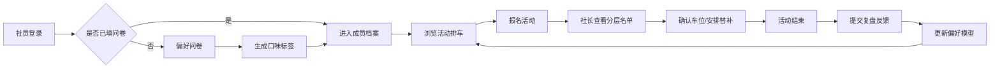

## 1. 产品概述

高校剧本杀社团组局板，解决新人不知选本格还是变格、社长排车顾此失彼的痛点。通过偏好问卷生成口味标签，智能匹配分层报名，复盘反馈驱动排车优化。

- **目标用户**：高校剧本杀社团成员（普通社员 + 社长/管理员）
- **核心价值**：降低新人入门门槛，提升社长排车效率，优化整车体验匹配度

## 2. 核心功能

### 2.1 用户角色

| 角色 | 登录方式 | 核心权限 |
|------|----------|----------|
| 普通社员 | 社团账号登录 | 填写偏好问卷、查看个人档案、报名活动、提交复盘反馈 |
| 社长/管理员 | 社团账号登录 + 管理员权限 | 发布活动、管理报名名单、查看所有成员偏好、查看反馈统计 |

### 2.2 功能模块

1. **成员档案页**：个人口味标签展示、偏好问卷、历史活动记录、偏好变化趋势
2. **活动排车页**：活动列表、发布活动表单、报名名单分层展示、匹配度计算
3. **复盘反馈页**：剧本评分、氛围评分、文字评价、社团偏好变化统计

### 2.3 页面详情

| 页面名称 | 模块名称 | 功能描述 |
|---------|---------|----------|
| 成员档案 | 个人信息卡 | 头像、昵称、身份标签（新社员/老社员/核心盘手） |
| 成员档案 | 口味标签云 | 逻辑推理、世界观脑洞、NPC演绎接受度、边缘角色接受度等维度标签 |
| 成员档案 | 偏好问卷 | 4-5道选择题，提交后生成/更新口味标签 |
| 成员档案 | 历史活动 | 参加过的剧本列表、评分记录 |
| 活动排车 | 活动卡片列表 | 按时间排序的活动卡片，显示类型、时间、人数、报名状态 |
| 活动排车 | 发布活动表单 | 剧本名称、类型选择（本格/变格/欢乐机制/混合）、时间、人数、老带新比例设置 |
| 活动排车 | 报名名单分层 | 核心盘手层、体验位层、替补层，每层显示匹配度百分比 |
| 活动排车 | 智能匹配提示 | 高亮显示高匹配度成员，提示老带新比例是否达标 |
| 复盘反馈 | 待反馈活动 | 显示已结束但未提交反馈的活动 |
| 复盘反馈 | 反馈表单 | 剧本评分（1-5星）、氛围评分（1-5星）、文字评价 |
| 复盘反馈 | 偏好变化统计 | 社团整体偏好迁移、个人口味变化趋势 |

## 3. 核心流程

## 4. 用户界面设计

### 4.1 设计风格

- **主色调**：深夜墨蓝 `#0f172a` 作为基底，营造悬疑推理氛围
- **点缀色**：琥珀金 `#f59e0b` 作为强调色，呼应剧本杀的线索感
- **辅助色**：迷雾灰 `#64748b`、朱砂红 `#dc2626`（警告/重要）、翡翠绿 `#10b981`（成功/高匹配）
- **字体**：标题使用 "Noto Serif SC" 衬线字体，体现推理文学感；正文使用 "Noto Sans SC" 保证可读性
- **按钮风格**：圆角中等（8px），悬停时有微妙的发光效果
- **布局风格**：卡片式布局，深色毛玻璃效果，层次分明
- **图标风格**：线性图标，琥珀金色描边

### 4.2 页面设计总览

| 页面名称 | 模块名称 | UI 元素 |
|---------|---------|---------|
| 成员档案 | 个人信息卡 | 深色卡片、渐变边框、头像带金色光环 |
| 成员档案 | 口味标签云 | 不同大小和颜色的标签，匹配度越高越醒目 |
| 成员档案 | 偏好问卷 | 分步式卡片问卷，进度条用琥珀金填充 |
| 活动排车 | 活动卡片 | 悬停上浮效果，左上角类型标签色区分 |
| 活动排车 | 分层名单 | 三层卡片堆叠，每层有不同的边框颜色和标题 |
| 活动排车 | 发布表单 | 毛玻璃模态框，分组字段，类型选择用大按钮 |
| 复盘反馈 | 评分组件 | 交互式星星评分，点击有粒子效果 |
| 复盘反馈 | 偏好变化图 | 平滑曲线图，展示各维度趋势 |

### 4.3 响应式

- 桌面端优先设计，三栏/两栏布局
- 平板端自适应为单栏堆叠
- 移动端优化触控区域，底部导航
- 卡片在小屏幕下占满宽度

### 4.4 动效与细节

- 页面加载时元素依次淡入上浮
- 标签悬停时有轻微放大和发光
- 评分星星点击时有金色粒子迸射
- 卡片切换时有平滑的滑动过渡
- 背景有微妙的噪点纹理，增加质感
