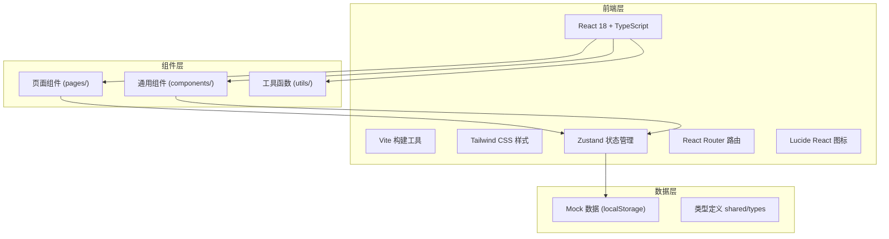
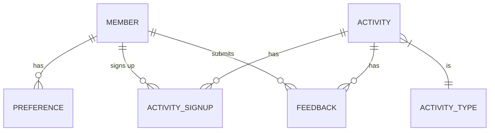

## 1. 架构设计



## 2. 技术描述

- **前端框架**: React 18 + TypeScript
- **构建工具**: Vite 5
- **样式方案**: Tailwind CSS 3
- **状态管理**: Zustand
- **路由方案**: React Router DOM 6
- **图标库**: Lucide React
- **数据持久化**: localStorage（模拟后端）
- **初始化工具**: vite-init

## 3. 路由定义

| 路由 | 页面 | 说明 |
|------|------|------|
| `/profile` | 成员档案页 | 个人信息、口味标签、偏好问卷、历史活动 |
| `/events` | 活动排车页 | 活动列表、发布活动、报名分层 |
| `/feedback` | 复盘反馈页 | 待反馈活动、反馈表单、偏好统计 |

## 4. 数据模型

### 4.1 实体关系图



### 4.2 数据定义

#### 成员 (Member)
```typescript
interface Member {
  id: string;
  name: string;
  avatar: string;
  role: 'member' | 'president';
  level: 'new' | 'experienced' | 'core';
  joinDate: string;
  activityCount: number;
}
```

#### 偏好标签 (Preference)
```typescript
interface Preference {
  memberId: string;
  logicReasoning: number; // 1-5 逻辑推理偏好
  worldBuilding: number; // 1-5 世界观脑洞偏好
  npcAcceptance: number; // 1-5 NPC演绎接受度
  edgeRoleTolerance: number; // 1-5 边缘角色介意程度
  socialPreference: number; // 1-5 社交互动偏好
  tags: string[]; // 生成的口味标签
  lastUpdated: string;
  history: { date: string; scores: PreferenceScores }[];
}
```

#### 活动 (Activity)
```typescript
interface Activity {
  id: string;
  title: string;
  scriptName: string;
  type: 'honkaku' | 'henkaku' | 'fun' | 'mixed'; // 本格/变格/欢乐机制/混合
  date: string;
  time: string;
  totalSlots: number;
  veteranRatio: number; // 老带新比例要求
  status: 'upcoming' | 'ongoing' | 'ended';
  description: string;
  createdBy: string;
  createdAt: string;
}
```

#### 报名记录 (ActivitySignup)
```typescript
interface ActivitySignup {
  id: string;
  activityId: string;
  memberId: string;
  matchScore: number; // 匹配度 0-100
  tier: 'core' | 'experience' | 'substitute'; // 核心盘手/体验位/替补
  signedUpAt: string;
}
```

#### 反馈 (Feedback)
```typescript
interface Feedback {
  id: string;
  activityId: string;
  memberId: string;
  scriptRating: number; // 1-5 剧本评分
  atmosphereRating: number; // 1-5 氛围评分
  comment: string;
  submittedAt: string;
}
```

## 5. 项目目录结构

```
src/
├── components/          # 通用组件
│   ├── Layout/         # 布局组件（导航、侧边栏）
│   ├── Card/           # 卡片组件
│   ├── Tags/           # 标签组件
│   ├── Rating/         # 评分组件
│   └── Modal/          # 模态框组件
├── pages/              # 页面组件
│   ├── Profile.tsx     # 成员档案页
│   ├── Events.tsx      # 活动排车页
│   └── Feedback.tsx    # 复盘反馈页
├── store/              # Zustand 状态
│   └── useStore.ts
├── utils/              # 工具函数
│   ├── matching.ts     # 匹配算法
│   ├── mockData.ts     # Mock 数据
│   └── storage.ts      # 本地存储
├── types/              # TypeScript 类型
│   └── index.ts
├── App.tsx
├── main.tsx
└── index.css
```

## 6. 核心算法说明

### 匹配度计算 (matching.ts)
根据活动类型和成员偏好计算匹配分数：
- 本格车：权重偏向逻辑推理
- 变格车：权重偏向世界观脑洞
- 欢乐机制车：权重偏向社交互动
- 混合车：综合各维度

### 分层规则
- 核心盘手：匹配度 ≥ 80 且有经验
- 体验位：匹配度 50-79
- 替补：匹配度 < 50 或名额已满

### 偏好更新
每次提交反馈后，根据评分调整偏好权重，形成个性化推荐模型。
